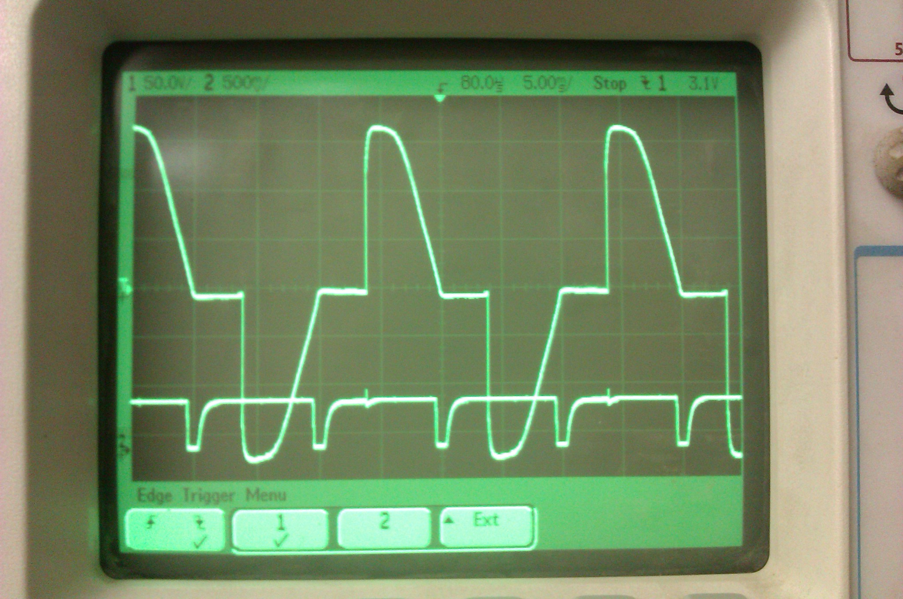
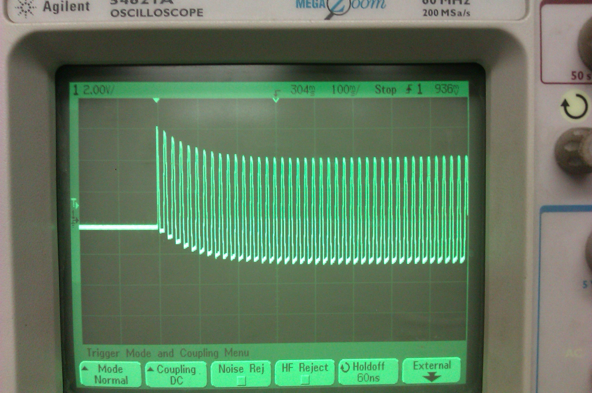
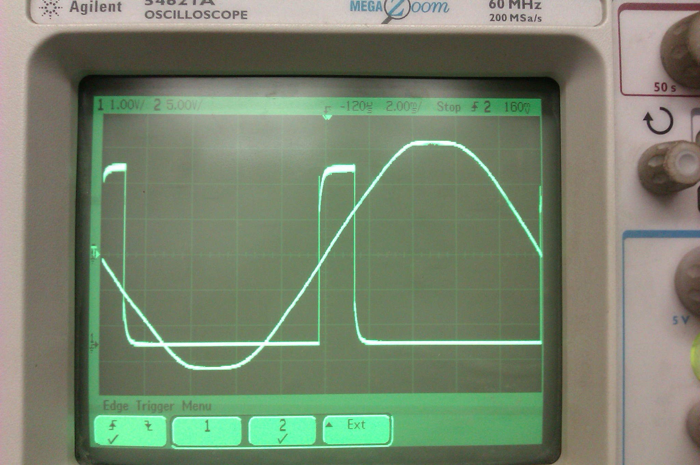
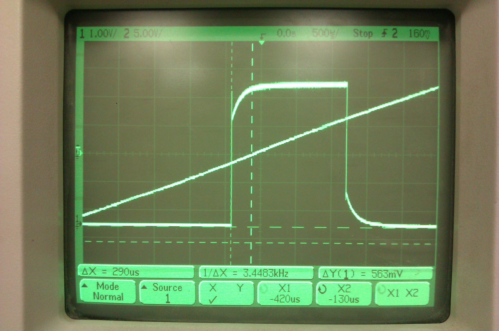

# Zero crossing triac controller Arduino Shield

An arduino shield that makes it easy to detect [zero crossings](http://en.wikipedia.org/wiki/Zero_cross_circuit) on mains AC, and control a triac with [phase control](http://playground.arduino.cc/Main/ACPhaseControl)

# Circuit board

* [Schematic](schematic.png)
* Eagle schematic/board in the repo
* order boards from [oshpark](http://oshpark.com/shared_projects/XGqh7Sy8)

# Todo

* opto is wrong way round (on silkscreen) as output is in the live side and input on the logic side.
* cap input is only up to 16v or so, not 240
* spaces for most R are too narrow
* add a cap on the zc input, got a bit of triac switching noise on it
* space for contrast variable r is way too small
* supply for lcd backlight?

# BOM

The [BOM](bom.txt) is in tab separated form, with Farnell part numbers. Missing parts are standard, or don't matter:

* Diodes are forming a low current bridge rectifier
* Caps - follow voltage and polarisation.
* Reistors - power rating 1/8W unless specified.

* Opto sensor is [tcrt5000](http://www.vishay.com/docs/83760/tcrt5000.pdf)

# Useful resources

I made use of the following in the design.

## Spindle controller

Thanks to Klaas for a great write up on a [cnc router controller](https://sites.google.com/site/klaasdc/cnc-router/spindle-controller) of which this project is mostly a copy of.

## Triac Block

Thanks to Mic at [wemakethings.net](http://wemakethings.net) for his work on the Triac Bloc:

* [git repo](https://github.com/Miceuz/triac-bloc)
* [pdf schematic](https://github.com/Miceuz/triac-bloc/blob/master/ssr.pdf)

## Triac controller datasheet

* This [opto isolated triac controller](http://www.farnell.com/datasheets/1806097.pdf) datasheet has a useful circuit for controlling triac including snubber circuit.

### Testing

The circuit has been tested with a 50W filament light and the target 500W router motor. Both perform well and are controlled smoothly with the ZC circuit below.

## Zero crossing circuit

* [Zero crossing circuit](http://www.dextrel.net/diyzerocrosser.htm)

I thought that if I made a second version I'd reduce part count by using an [AC input opto coupler](http://www.vishay.com/docs/83608/h11aa1.pdf) for the zero crossing sensor. However, talking to Mic about his experience, it seems the zero crossing circuit I'm using works better and reduces software complexity. One reason is that you get a pulse just before the zero cross which makes it easy to turn off the triac in time.

### How it works

The discussion on the [Zero crossing circuit page](http://www.dextrel.net/diyzerocrosser.htm) is very good but there were a few things that I didn't understand to start:

* The diodes, resistors and capacitor are a simple regulator that makes a relatively low ripple DC supply at around 12V.
* The diode under the capacitor allows us to compare the voltage on the cap with the unrectified mains voltage.
* The transistor then is switched when the voltage of the cap is lower than the mains voltage, this means we'll get switched on just before the ZC and off just after.
* The output resistor R5 isn't just to pull high, it allows the transistor in the opto to saturate, giving well shaped output pulses.

Additionally:

* I was getting a bit of switching noise on the ZC signal, which was resolved with a 10nf capacitor in parallel.

### Testing

Here are some scope pics of the zero crosser in action.

")

# License

This hardware is licensed under the [CERN open hardware license 1.2](http://www.ohwr.org/attachments/2388/cern_ohl_v_1_2.txt), which also included in this repository.
