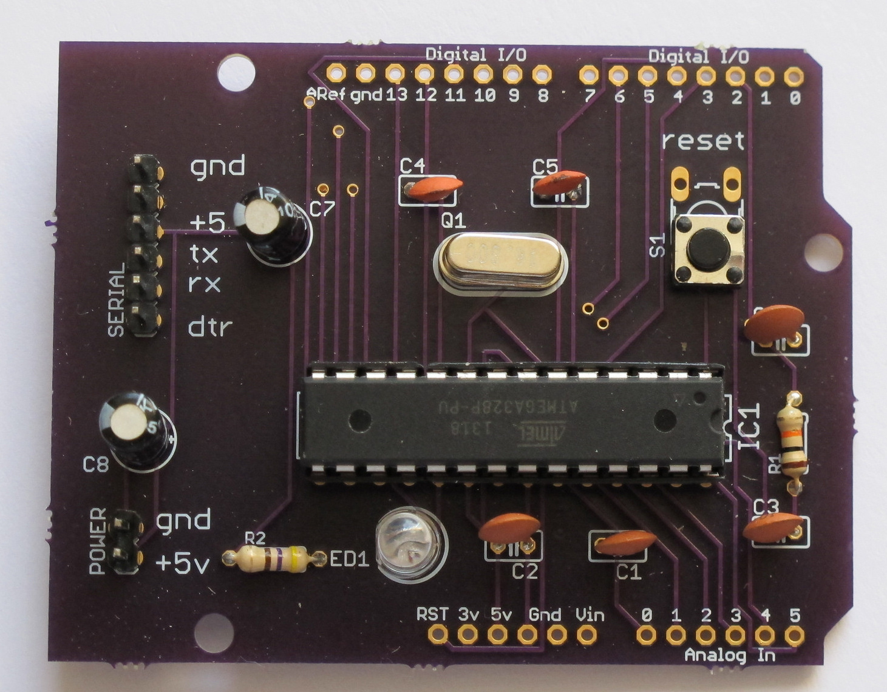
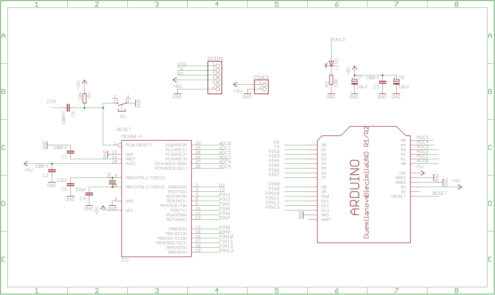
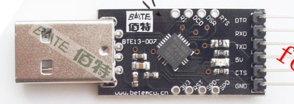

# Workshop links

* this document: http://bit.ly/shrimp-links
* [workshop handout](https://github.com/mattvenn/eagle-circuit-designs/blob/master/shrimp/handout.pdf?raw=true)
* shrimp website: http://shrimping.it/blog/shrimp/

# Aim!

* To learn enough Eagle to translate a picture of a schematic (circuit diagram) into a schematic in Eagle.
* To create a board based on the schematic, and do the layout.
* Learn how to create the files required for manufacture.
* Learn how to check the design files.
* Place an order for our PCBS with http://oshpark.com.

Here's one I made earlier!

# PCB Basics

* Sparkfun's glossary: https://learn.sparkfun.com/tutorials/pcb-basics

# Schematic

We'll be mostly following this guide from sparkfun: https://learn.sparkfun.com/tutorials/using-eagle-schematic

You'll need to install the Adafruit eagle library to get access to the Arduino shield layout:

* Eagle Version 5: https://github.com/adafruit/Adafruit-Eagle-Library/archive/6042b7efe7b0f2f9511c54ebdba88d8e4de44aa2.zip
* Eagle Version 6: https://github.com/adafruit/Adafruit-Eagle-Library/archive/master.zip

Here's the schematic direct from the shrimp website: http://shrimping.it/blog/shrimp/shrimpduino_schem/, and I've made a version of this that includes the shield (see reverse of the handout):

Here's how the Arduino's pin numbers map to the real pin numbers of the Arduino chip: http://arduino.cc/en/Hacking/PinMapping168 (though this says it's the 168, it's the same for the 328)

And here's the datasheet of the Arduino chip (ATMega328): http://www.atmel.com/Images/doc8161.pdf

Here's the baite USB to serial TTY module: http://www.aliexpress.com/snapshot/6012255471.html

## Things to watch out for

* Use the net tool (not wire) for linking components.
* Make sure that the TX of the USB module connects to the RX of the Arduino and vica versa for the RX.

## Checking the schematic

Run an Electrical Rule Check (ERC) and read through the errors. Some we can ignore but some may flag serious issues.

# Board Layout

We'll be mostly following this guide from sparkfun: https://learn.sparkfun.com/tutorials/using-eagle-board-layout

Move the components around until you've got them all fitted well. You want the decoupling capacitor (C3) close to the chip.

Once you've got the components in the right place, route the wires.

## Checking the board

Run a Design Rule Check (DRC) to check your board's OK. As before you'll probably get a lot of errors and warnings. We need to know which we can ignore and which we have to fix.

The default DRC rules are fine, but you can optionally use these DRC rules from sparkfun: https://dlnmh9ip6v2uc.cloudfront.net/assets/1/e/3/2/0/52054e25757b7f44119e09da.zip

It's also possible to get a DRC ruleset for hand making boards (ensures bigger pads and traces etc).

# Gerber generation

Now the board is done, we generate the files that the machines will use to create the board.

Download this [CAM file](sfe-gerb274x.cam)

From the board view, run the CAM processor and select the downloaded CAM file. Click 'process job'and have a look in your project directory for the files. These are the most important:

* GBL Bottom Copper
* GTL Top Copper
 
* GBO Bottom Silkscreen
* GTO Top Silkscreen
 
* GBS Bottom Soldermask
* GTS Top Soldermask
 
* TXT Drill File
* GML Mill Layer

You can check your board with a web based 3d viewer: http://mayhewlabs.com/webGerber/ 

You can also use an offline gerber viewer like: http://sourceforge.net/projects/gerbv/ (Linux only).

Have a look at the OSHPark guidelines: https://oshpark.com/guidelines

Then upload a zip of your gerbers to http://oshpark.com

## Things to watch out for

* OSHPark requires something on all layers (including the bottom silk screen), so put something on there before uploading.

## OSHPark pricing

* £1 per square inch,
* 2 layers,
* free postage to UK,
* minimum order of 3,
* so a set of 3 x 5.6 square inch boards (size of the Arduino) would be £17.25
* https://oshpark.com/pricing

# Ordering PCBs from other places

Good overview of lots of services by @boldport: http://boldport.blogspot.com.es/2014/02/so-you-want-to-manufacture-your-printed.html

# Parts and building

After your board arrives, here's a BOM (bill of materials) if your part numbers match the ones I used in the schematic above. http://bit.ly/shrimp-pcb-bom

And here's a page that shows what each component looks like (Thanks Cefn at shrimping.it): http://shrimping.it/blog/shrimp-pcb-parts/

# Even More links

## Tutorials

* All sparkfun's Eagle tutorials: https://learn.sparkfun.com/tutorials/tags/eagle
* Couple of good instructables on creating schematics and boards:
    * http://www.instructables.com/id/Draw-Electronic-Schematics-with-CadSoft-EAGLE/
    * http://www.instructables.com/id/Turn-your-EAGLE-schematic-into-a-PCB/

## Reference

* Good reference guide from a different workshop: http://psas.pdx.edu/EagleCadWorkshopNotes/#index19h1

## Eagle Extensions

* Python extension: https://github.com/rmawatson/PyEagle
* Lots of ULPs: http://web.cadsoft.de/cgi-bin/download.pl?page=/home/cadsoft/html_public/demo.htm&dir=eagle/userfiles/ulp

## Other PCB Cad tools

* Design Spark: http://www.rs-online.com/designspark/electronics/eng/page/designspark-pcb-home-page
* KiCad: http://www.kicad-pcb.org/display/KICAD/KiCad+EDA+Software+Suite 

# ShrimpPCB License

* This hardware is licensed under the [CERN open hardware license 1.2](http://www.ohwr.org/attachments/2388/cern_ohl_v_1_2.txt), which also included in this repository.
